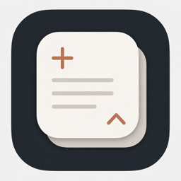
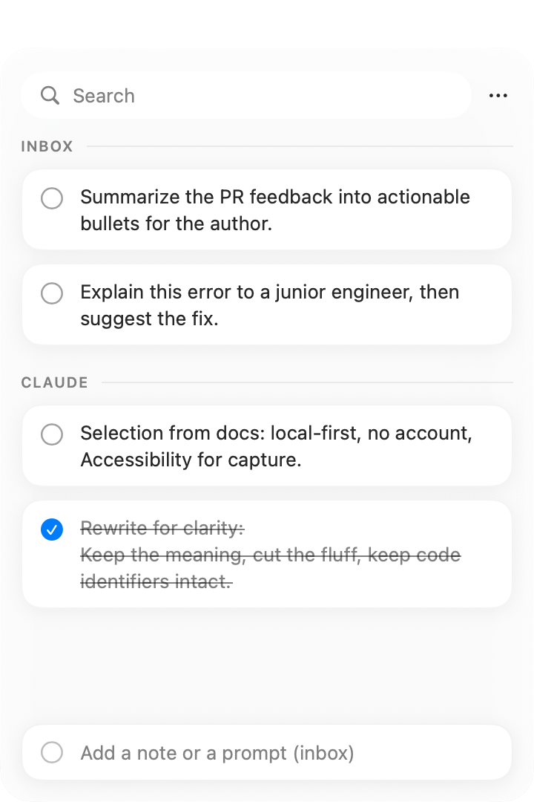

<p align="center">
  
</p>

# SidePrompt

<p align="center">
  Local-first Mac scratchpad for AI-assisted work — capture selections from any app, stage prompts, copy them back when ready.
</p>

<p align="center">
  <strong>Open source.</strong> MIT licensed. No account, no sync, no telemetry.
</p>

<p align="center">
  
  
  
</p>

<p align="center">
  
</p>

## Why

When you bounce between ChatGPT, Claude, Cursor, and the browser, useful bits scatter everywhere. SidePrompt is a floating queue for those bits: capture with a shortcut, organize in sections, copy back as a list when you need them.

## Features

- Double-tap **Shift** (configurable) to capture the current selection from any app
- Floating panel with sections, search, checkboxes
- **⌘-click** multi-select, **Shift-click** range select
- Copy / Copy as List / Merge
- Prompt templates with `{{variables}}`
- Local JSON storage only

## Requirements

- macOS 14+
- Accessibility permission (reads text selection + global shortcuts)

## Install (from source)

```bash
git clone https://github.com/yavuz/SidePrompt.git
cd SidePrompt
xcodegen generate
open SidePrompt.xcodeproj
```

Build & run in Xcode (sign with your team), then grant **Accessibility** for the built app.

CLI:

```bash
xcodegen generate
xcodebuild -scheme SidePrompt -configuration Debug -derivedDataPath build/DerivedData build
open build/DerivedData/Build/Products/Debug/SidePrompt.app
```

## Shortcuts

| Action | Shortcut |
| --- | --- |
| Capture selection | Double-tap `Shift` (Settings → configurable) |
| Show panel | Menu bar icon or `⌘⇧P` (configurable) |
| Edit item | Click |
| Multi-select | `⌘`-click |
| Range select | `Shift`-click |
| Copy selected | `⌘C` |
| Copy as list | `⌘⇧C` |
| Select all | `⌘A` |
| Merge selected | `⌘⇧M` |
| Delete selected | `Delete` |
| Close editor / panel | `Esc` |

Templates: panel `•••` → **Templates…** — use `{{variable}}` placeholders.

## Data

`~/Library/Application Support/SidePrompt/store.json`

Nothing is uploaded. Keep Time Machine (or any backup) on.

## Project layout

```
SidePrompt/           # Swift sources
docs/                 # Landing page + Sparkle appcast scaffold
scripts/package.sh    # Release ZIP/DMG (+ optional notarize)
project.yml           # XcodeGen
```

## Release (maintainers)

```bash
./scripts/package.sh
# Optional:
NOTARIZE=1 APPLE_ID=... APP_PASSWORD=... TEAM_ID=... ./scripts/package.sh
```

Sparkle keys / hosted appcast are optional for open-source builds. Placeholder `SUPublicEDKey` disables the updater until configured.

## Contributing

Issues and PRs welcome. Keep the app local-first: no analytics, no forced accounts.

## License

MIT — see [LICENSE](./LICENSE).
